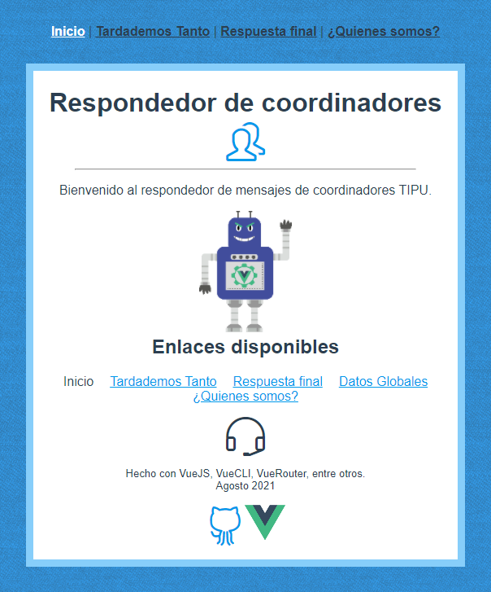
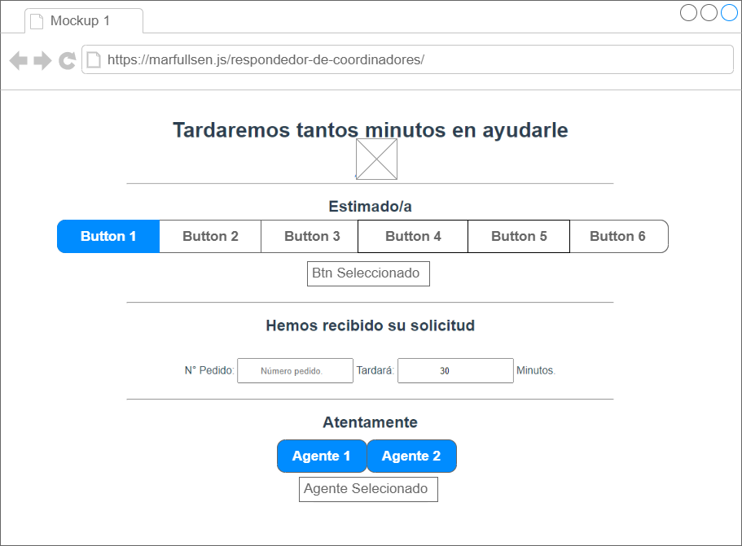
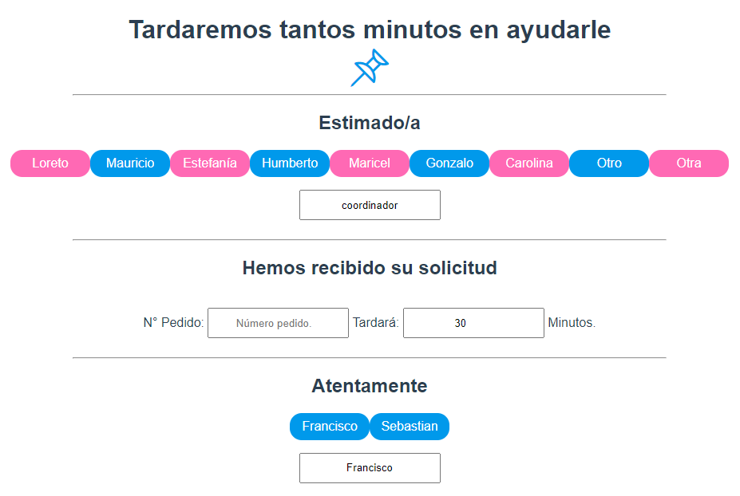
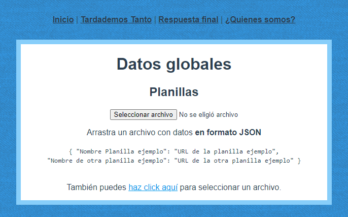

# Respondedor de coordinadores

<a href="https://github.com/vuejs/vue">
  
</a>
<a href="https://github.com/vuejs/vue">
  
</a>
<a href="https://github.com/vuejs/vue">
  
</a>
<br><br>


## ¿Qué es esto?
Sitio web que genera mensajes de respuesta a coordinadores TIPU.

## ¿Qué puedo hacer con este sitio?
La última versión del sitio web permite:
- Generar una primera respuesta especificando la tardanza.
- Personalizar el coordinador a quien se le dirige.
- Personalizar un número de pedido.
- Personalizar el tiempo aproximado que tardará.
- Personalizar el agente que realiza el trabajo.
- Generar una respuesta definitiva al proceso realizado.
- Personalizar el nombre y código de un curso clonado.
- Personalizar el nombre de la planilla y filas cargadas.
- Personalizar las planillas fijadas en botones de acceso rápido.
- Seleccionar mensajes fijos como:
  - Quedo atento.
  - Realización de envío de correos.
  - Incorporación de bloque SENCE.
  - Reporte de actualización de clase virtual.
- Copiar rápidamente las respuestas haciendo doble click.
- Limpiar campos haciendo click en los títulos de cada página.
- Desplazamiento rápido gracias a flechas "Siguiente página/volver"
- Disponibilidad de moverse por el sitio incluso frente a caidas de internet.

## ¿Qué necesito instalar?
Para hacer uso del sitio sólo se requiere un navegador.

Para realizar modificaciones al código, se necesita:
- Node.js 14 o superior.
- VueCLI 4.5.13 o superior.
- VueRouter.

# Entorno para desarrollo
### Instalación del proyecto
```
npm install
```

### Compilar y recargar rápidamente el desarollo
```
npm run serve
```

### Compilar y minificar para producción
```
npm run build
```

### Lints y reparación de archivos
```
npm run lint
```

### Personalizar la configuración
Ver [referencia de configuración](https://cli.vuejs.org/config/).

## Capturas de pantalla.

Mockup que dió inicio al proyecto.




Boceto final transpasado a HTML con CSS.




Subida del archivos JSON para auto-completar nombres y links de planillas.




Otras capturas de pantalla.
- [Tardaremos tanto](./docs/screenshots/tardaremos-tanto-2021-09-02-12_26_56.png).
- [Respuesta final](./docs/screenshots/respuesta-final-2021-09-02-12_30_36.png).
- [Respuesta final con planillas instaladas](./docs/screenshots/respuesta-final-with-planillas-2021-09-02-13_36_32.png)

## Recursos
- Instalar fuentes manualmente en Vue-CLI [https://reactgo.com/add-fonts-vue-app/](https://reactgo.com/add-fonts-vue-app/)
- Inspeccionar archivos de fuentes online [https://fontdrop.info/](https://fontdrop.info/)
- [Simple-Line-Icons](https://github.com/thesabbir/simple-line-icons)
- Background photo: [Dune du Pilat](https://unsplash.com/photos/S0sD0DbArgk) by Matt Mariannelli.
- Mockup by [Screenshot Rocks!](https://screenshot.rocks/).
- [Text Reader with Vue](https://codesandbox.io/s/4p0k1xly4).
- [Drag&Drop with Vue](https://codepen.io/stenvdb/pen/wvBoYQO).


<br><br>
